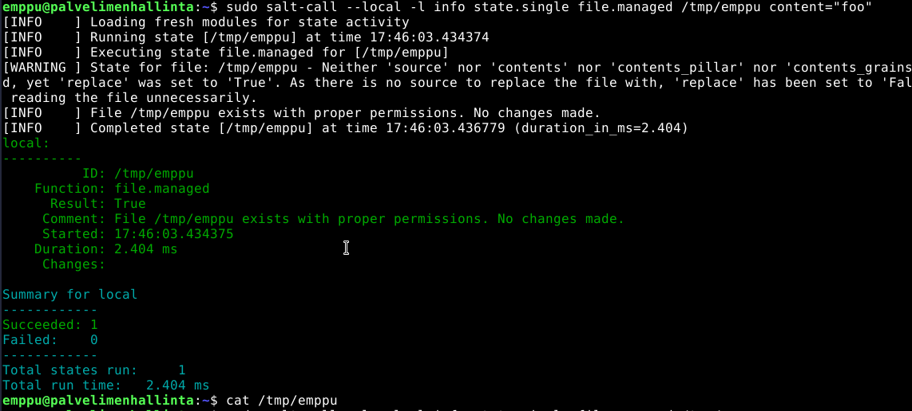
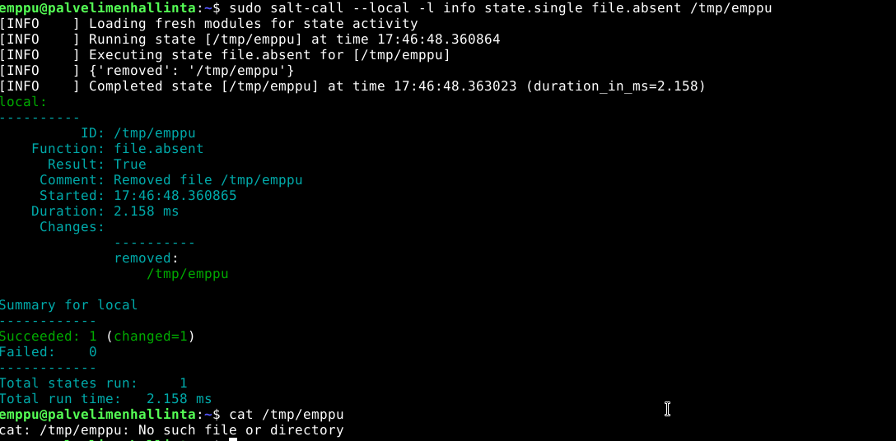
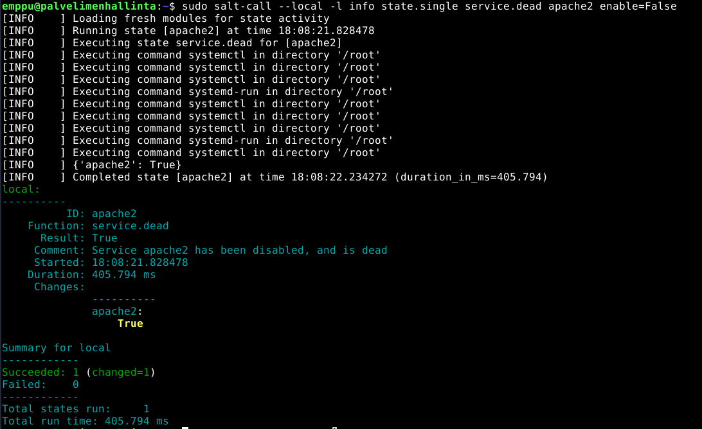
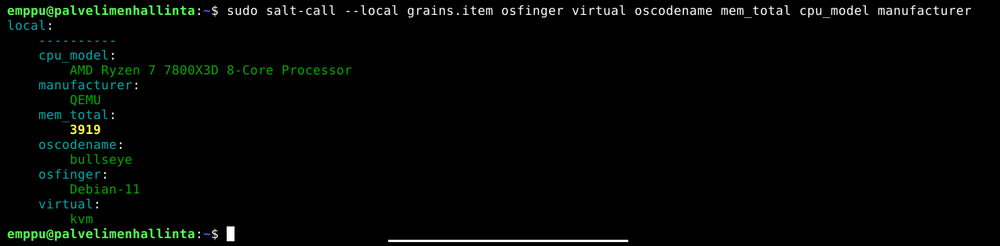

## x) Lue ja tiivistä. 

### Create a Web Page Using Github

-Rekisteröidy githubiin.

-Muista luoda README tiedosto.

-Luo .md tiedosto tekstiä varten.

-Github luo automaattisesti .md tiedostosta verkkosivut.

Lisää kuva tai linkki tiedostoon:

	

### Run Salt Command Locally

Salt komentojen asennus:

	sudo apt install salt-minion 

Tärkeimmät tilafunktiot: pkg, file, service, user, cmd. 

## a) Asenna Salt (salt-minion) koneellesi.

Koneessa pyörii Debian 11 joten voin skipata saltin oman repon laittamisen koneelle. 

Aluksi päivitin pakettilistat komennolla:

	sudo apt update

Sen jälkeen asensin Saltin komennolla:

	sudo apt install salt-minion

## b) Viisi tärkeintä. Näytä esimerkit viidestä tärkeimmästä Saltin tilafunktiosta: pkg, file, service, user, cmd. Analysoi ja selitä tulokset.

### pkg

Seurasin ohjeita Teron sivuilta, seuraavalla komennolla asentui tree:

	sudo salt-call --local -l info state.single pkg.installed tree

Komennolla pystyin testaamaan että se toimi:

	tree

Seuraavalla komennolla poistin tree koneesta:

	sudo salt-call --local -l info state.single pkg.removed tree

### file

Loin uuden tiedoston komennolla:

	sudo salt-call --local -l info state.single file.managed /tmp/emppu

Sen jälkeen koitin lisätä sisältöä tiedostoon:

	sudo salt-call --local -l info state.single file.managed /tmp/emppu content="foo"

mutta se ei toiminut, poistin tiedoston komennolla:

	sudo salt-call --local -l info state.single file.absent /tmp/emppu

ja koitin uudestaan komentoa:

	sudo salt-call --local -l info state.single file.managed /tmp/emppu contents="foo"

jonka jälkeen siinä näkyi "foo" sisältönä. Huomasin että aikaisemmin olin kirjoittanut contents ilman s kirjainta lopussa jonka takia se ei toiminut ja testasin vielä että tiedoston muokkaaminen onnistuu.

### Service

Minulla oli jo Apache asennettuna ja pyörimässä joten aloitin tehtävän sulkemalla sen Saltilla.

Laitoin seuraavan komennon ja tarkistin että Apache sulkeutui: 

	sudo salt-call --local -l info state.single service.dead apache2 enable=False

Käynnistän sen uudestaan seuraavalla komennolla ja tarkistan että se on käynnissä:

	sudo salt-call --local -l info state.single service.running apache2 enable=True

### User

Loin uuden käyttäjän komennolla:

	sudo salt-call --local -l info state.single user.present kaniini

Tarkistin että salt oli luonut uuden käyttäjän cat /etc/passwd komennon avulla, sen jälkeen laitoin seuraavan komennon poistaakseni käyttäjän:

	sudo salt-call --local -l info state.single user.absent kaniini

### CMD 

Laitoin komennon: 

	sudo salt-call --local -l info state.single cmd.run 'touch /tmp/foo' creates="/tmp/foo"

Tarkistin että /tmp/foo oli luotu.

Kokeilin komentoa uudestaan:

	sudo salt-call --local -l info state.single cmd.run 'touch /tmp/foo' creates="/tmp/foo"

Ja se kertoo että tiedosto on jo olemassa eikä mitään ole muutettu, korostetussa kohdassa lukisi "Succeeded: 1 (Changed=1)" jos jotain olisi muutettu.

## c) Idempotentti. Anna esimerkki idempotenssista. Aja 'salt-call --local' komentoja, analysoi tulokset, selitä miten idempotenssi ilmenee.

Koitin komentoa:

	sudo salt-call --local -l info state.single cmd.run 'touch /tmp/foo' creates="/tmp/foo"

Sen jälkeen ilman creates:

	sudo salt-call --local -l info state.single cmd.run 'touch /tmp/foo'

Se ilmoittaa että asioita olisi muutettu vaikka lopputulos on sama kun että ei olisi tehnyt mitään.

## d) Tietoa koneesta. Kerää tietoja koneesta Saltin grains.items -tekniikalla. Poimi kolme kiinnostavaa kohtaa, näytä tulokset ('grains.item osfinger virtual') ja analysoi ne.

Laitoin seuraavan komennon:

	sudo salt-call --local grains.item osfinger virtual oscodename mem_total cpu_model manufacturer

Se listaa käyttöjärjestelmän, käyttöjärjestelmän nimen, muistin määrän, prosessorin mallin, virtualisoinnin tyypin ja koneen valmistajan. 

# Lähteet: 

Linux List All Users In The System Command, Gite 2023: https://www.cyberciti.biz/faq/linux-list-users-command/

Tarkistin kieliasun ChatGPT:llä

Run Salt Command Locally, Karvinen 2021: https://terokarvinen.com/2021/salt-run-command-locally/

Infra as Code 2023, Karvinen 2023: https://terokarvinen.com/2023/configuration-management-2023-autumn/

Grains: https://intothesaltmine.readthedocs.io/en/latest/chapters/command-and-control/grains.html

Create a Web Page Using Github, Karvinen 2023: https://terokarvinen.com/2023/create-a-web-page-using-github/
