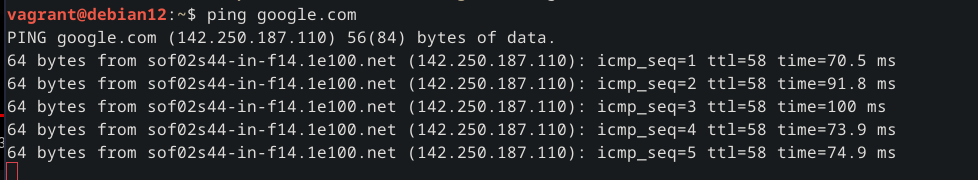

# H2 Karjaa

Host koneen rauta:

Käyttöjärjestelmä - Debian 12 Bookworm

CPU - AMD Ryzen 7 7800X3D 

GPU - AMD ATI 7900 XTX

RAM - 32Gt.

Harjoitukset tehty Vagrantilla

## x) Lue tiivistä

### What is the definition of "cattle not pets"?

Rakennetaan infra siten ettei ole yhtä heikkkoa kohtaa johon koko pakka kaatuu, ja jos jokin palvelin kaatuu niin voidaan helposti pystyttää uusi vastaavanlainen tilalle.

## Vagrant Revisited – Install & Boot New Virtual Machine in 31 seconds

    vagrant init (distro nimi)

    vagrant up 

    vagrant ssh

Näillä komennoilla luot uuden virtuualikoneen

## Configure Windows and Linux with Single Salt Module
Luodaan logiikka joka tunnistaa onko salt orja windows tai jokin muu käyttöjärjestelmä ja muokataan komennot kullekkin käyttöjärjestelmälle sopiviksi.

Windowsille

     if "Windows" == grains["os"]

CentOSlle

     if "CentOs" == grains["os"]
  

## a) Asenna Vagrant.

Asensin vagrantin komennolla

	sudo apt install vagrant -y

## b) Asenna yksi kone Vagrantilla, ota siihen SSH-yhteys, osoita että netti toimii.

Loin uuden kansion vagrantille 

	mkdir vagrant
	cd vagrant

Asensin Debian 12 käyttöjärjestelmän

	vagrant init/debian12
	vagrant up

Otin yhteyden SSH:llä vagranttiin 

	vagrant ssh

Testasin että verkko toimii

## c) Oma orjansa. Asenna Salt herra ja orja samalle koneelle.

Asensin salt minionin.

Sekä salt masterin.

## d) Asenna Saltin herra-orja arkkitehtuuri toimimaan verkon yli. (Verkko voi olla virtuaalinen verkko paikallisten virtuaalikoneiden välillä, kuten muissakin alakohdissa)

Loin uuden Vagrant koneen määrittelen siitä orjan ja asensin salt minionin sille. 

Otan muistiin molempien vagrant koneiden IP osoitteet jotka sai konetta asentaessa.

Master IP: 192.168.121.74

Slave IP: 192.168.121.136

Ip osoitteen myös löytää pyörittämällä seuraavan komennon molemmilla koneilla: 

	sudo salt-call --local grains.item ipv4

Master koneella muokkasin interface kohtaan koneen oman ip osoitteen

	sudo micro /etc/salt/master

Orja koneella laitoin

	sudo micro /etc/salt/minion

lisäsin master kohtaan ja id kohtaan, otin risuaidat myös pois.

	master: 192.168.121.74

	id: slave
	
käynnistän salt-minion uudestaan

	sudo systemctl restart salt-minion

Herra koneella laitan ja hyväksyn orja koneen avaimen 

	sudo salt-key -A

Testasin komentoa

	sudo salt slave grains.item ipv4

ja sain vastaukseksi orjan ipv4 osoitteen

## e) Aja useita idempotentteja (state.single) komentoja verkon yli.

Laitoin komennon:

	sudo salt slave state.single pkg.installed tree

Testasin että tree toimi slave koneella

Sama poistolle 

	sudo salt slave state.single pkg.removed tree	

## f) Kerää teknistä tietoa orjista verkon yli (grains.item)

Pyysin koneelta, käyttöjärjestelmää, id:tä, ipv4 osoitetta, virtualisoinnin tyyppiä ja prosessorin mallia

	sudo salt slave grains.item osfinger id ipv4 virtual cpu_model

Kaikki muut paitsi prosessorin malli vaikuttaa olevan oikein.

## g) Aja shell-komento orjalla verkon yli.

Tein uuden tiedoston nimeltä moiccu.txt ja sisällöksi laitoin moiccu 

	sudo salt slave cmd.run 'echo moiccu | tee -a /home/vagrant/moiccu.txt'

## h) Hello, IaC.

Loin aluksi uuden kansion /srv/salt/hello, sen jälkeen tein uuden tiedoston nimeltä init.sls sisällöksi laitoin seuraavan.

	sudo salt slave state.apply hello

En ole ihan varma jos ymmärsin tehtävänannon oikein?

## Lähteet:

https://terokarvinen.com/2023/configuration-management-2023-autumn/

https://terokarvinen.com/2017/04/11/vagrant-revisited-install-boot-new-virtual-machine-in-31-seconds/

https://terokarvinen.com/2023/salt-vagrant/

https://oispadotka.wordpress.com/2020/05/12/h6/ 

https://docs.saltproject.io/en/latest/ref/configuration/minion.html

https://docs.saltproject.io/en/latest/topics/tutorials/starting_states.html
