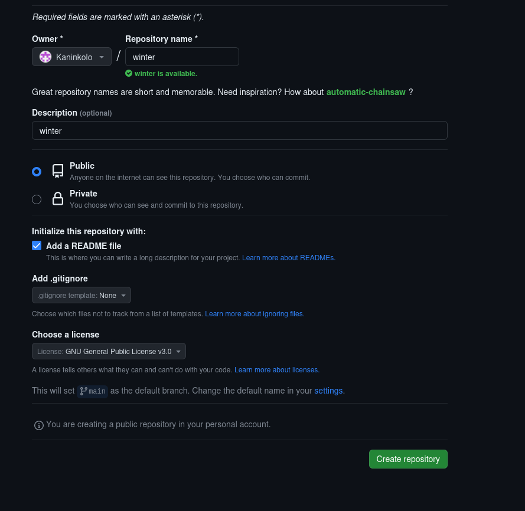
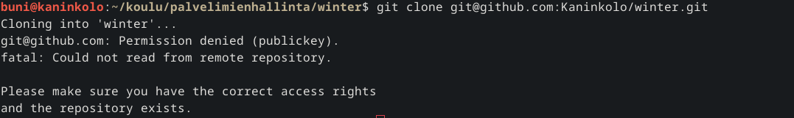
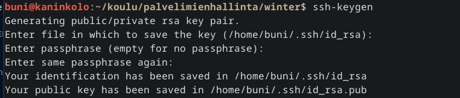
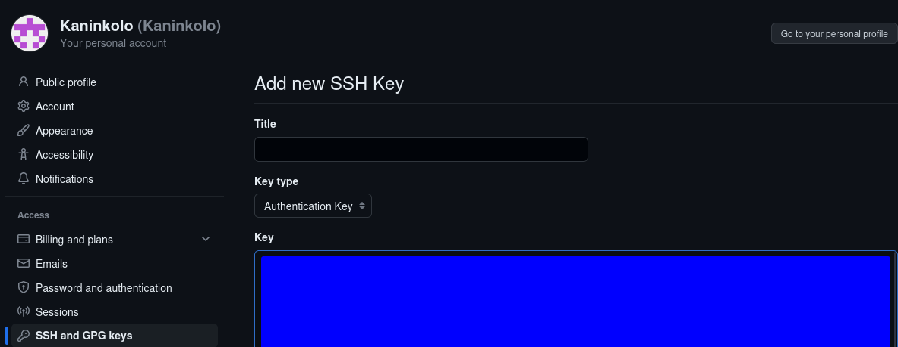
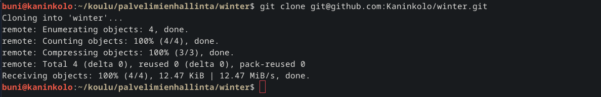
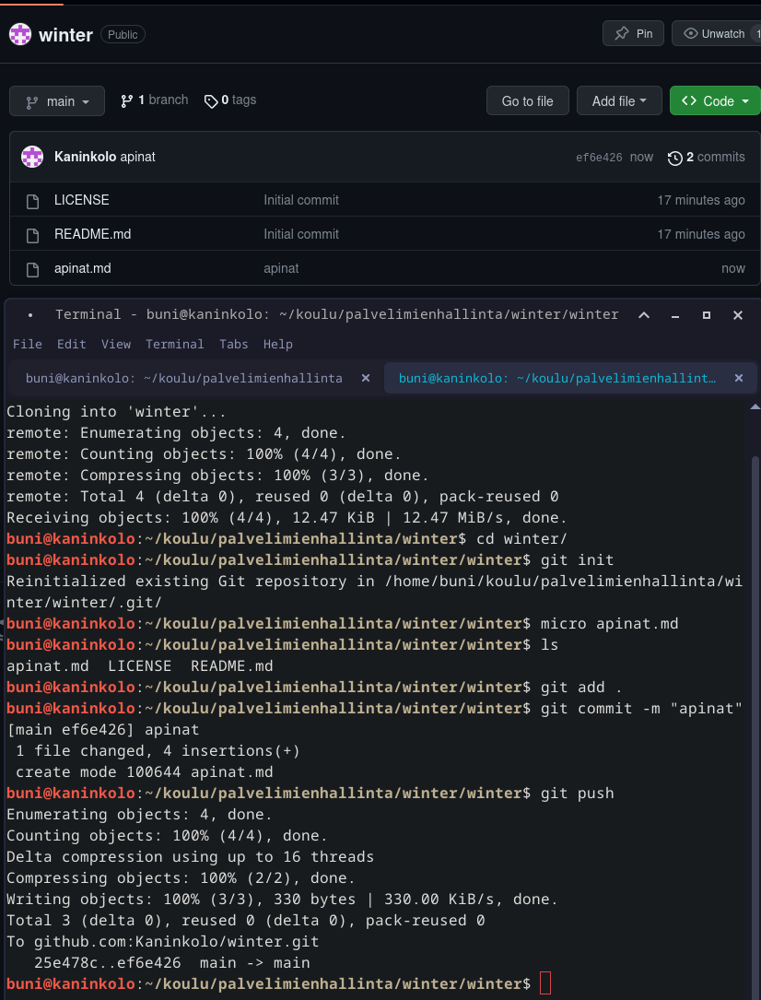
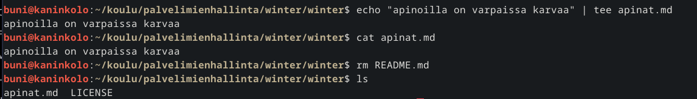
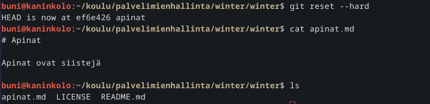
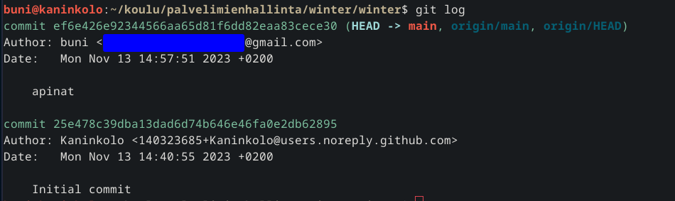

# h3 Versio

## a) Online. Tee uusi varasto GitHubiin

Loin uuden repon Githubiin nimeltä winter, lisäsin README tiedoston sekä laitoin lisenssiksi GNU3 

## b) Dolly. Kloonaa edellisessä kohdassa tehty uusi varasto itsellesi

Tein uuden kansion nimeltä winter, koitin kloonata ssh mutta en ollut lisännyt ssh avaimia githubiin joten tein uudet avaimet ja lisäsin ne. Sen jälkeen kloonaus onnistui.

Loin uuden tiedoston nimeltä apinat.md ja puskin sen githubiin.

## c) Doh! Tee tyhmä muutos gittiin, älä tee commit:tia.

Voi ei vahingossa kirjoitin apinat.md tiedoston päälle ja poistin README tiedoston, seuraavalla komennolla palautan versiot.

	git reset --hard

## d) Tukki.

	git log

Siellä näkyy repon luominen ja apinat.md lisääminen ja sen committaamisen viesti "apinat." Tietoja käyttäjistä löytyy ja ne ovat ne jotka olen koneelle määritellyt.

## Lähteet:

Karvinen 2023: https://terokarvinen.com/2023/configuration-management-2023-autumn/
