## H4 - Demonit

## x) Lue ja tiivistä

### Infra as Code - Your wishes as a text file

- Ei saa käyttää tabejä koodissa!

### top.sls

- Voit laittaa että komennot pyörii aina kun laittaa state.apply komennon saltille.

### yaml

- Avain: arvo
- Kommentit risuaidalla #
- Kaikki avaimet pitää kirjoittaa oikein isoilla/pienillä kirjaimilla

## a) Hello SLS!

Olin jo aikaisemmassa tehtävässä tehnyt hello SLS tiedoston joten muokkaan sitä.

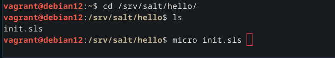

Muokkasin init.sls tiedoston /srv/salt/hello/init.sls hakemistossa

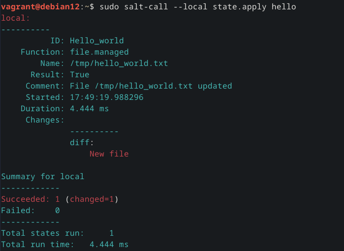
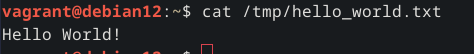
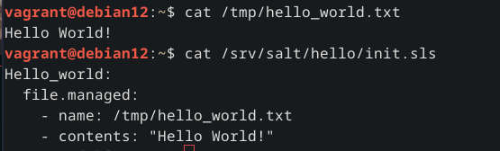

## b) Top. Tee top.sls

Menin hakemistoon /srv/salt ja loin uuden tiedoston top.sls. Kokeilin myös pyörittää komentoa mutta olin jon aiemmin pyörittänyt hello salt komennon jolloin se ei muuttanut tilaa.

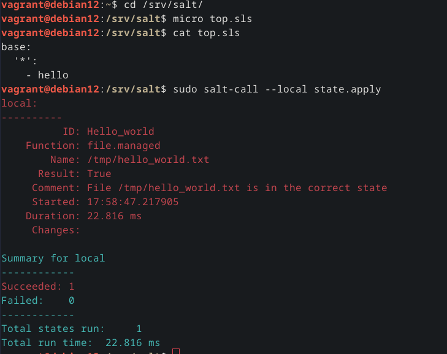

## c) Apache. Asenna Apache

Asensin aluksi Apachen 

	sudo apt install apache2

ja testasin että se toimii

	curl -s localhost | grep -oE '<title>.*</title>'

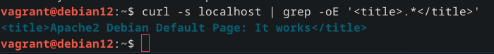

Kävin muokkaamassa /var/www/html/index.html tiedostoa ja testasin että muutokset näkyvät.

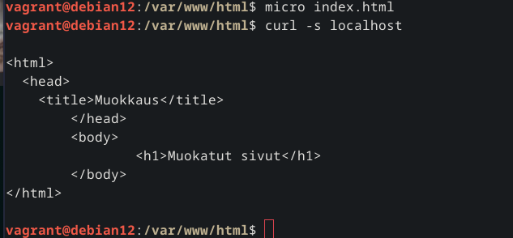

Sen jälkeen menin eri Vagrant koneeseen ja tein uuden tiedoston hakemistoon /srv/salt/ nimeltä apache.sls ja koitin komentoa, komento meni läpi parin yrityksen jälkeen kun tajusin ettei .sls päätettä tarvitse komennossa, huomasin komennosta että aloitussivun muuttaminen ei mennyt läpi koska olin laittanut sen sijainnin väärin "Comment: Source file salt://home/vagrant/index.html not found in saltenv 'base'"

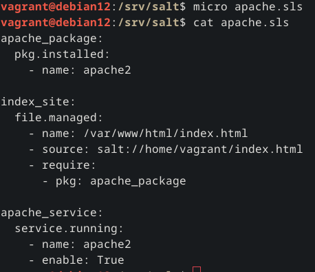
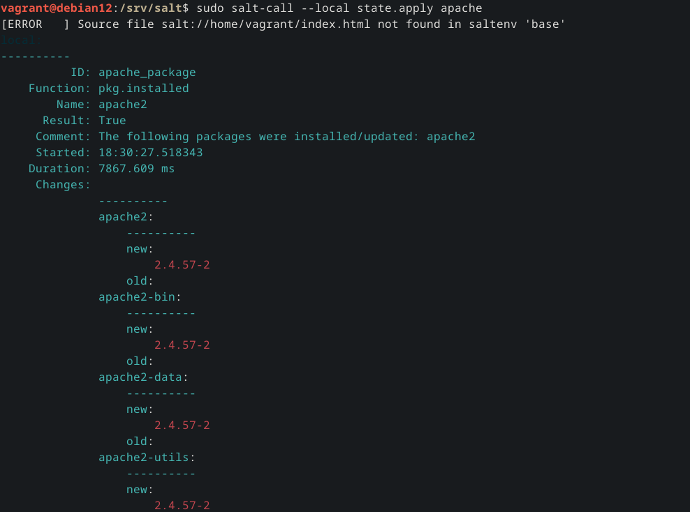

Joten kävin muokkaamassa komentoa poistamalla salt:// index.html sijainnin edestä jonka jälkeen myös etusivun muuttaminen onnistui.

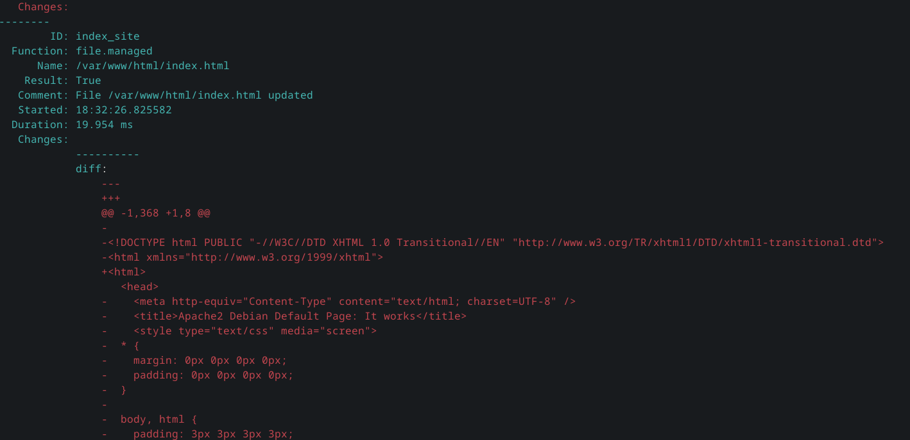
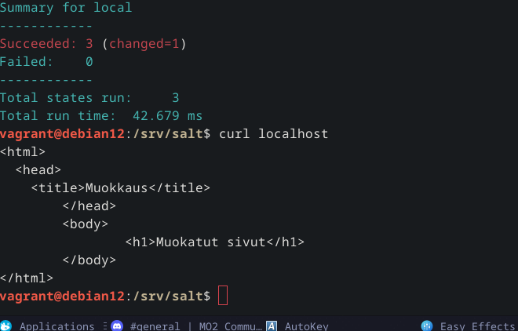

## d) SSH Portin muuttaminen

Muokkasin QEMUn käynnistys skriptiä siten että VMn portti 6022 on auki Host koneelle lisäämällä -net user,hostfwd=tcp::6022-:6022 käynnistys asetuksiin, ja VM koneelta muokkasin tiedosto /etc/ssh/sshd_config että siellä on port 6022, käynnistin SSHn uudestaan ja testasin että voin ottaa ssh yhteyden VM koneeseen.

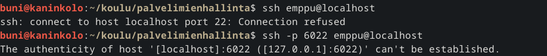

Otan kopion sshd config tiedostosta /srv/salt hakemistoon.

Sen jälkeen kävin laittamassa portin takaisin kommentoiduksi että voin muokata sen Saltilla.

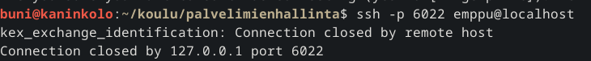

Tein uuden tiedoston ssh_port.sls /srv/salt hakemistoon, muokkasin teron sivuilla ollutta esimerkkiä.

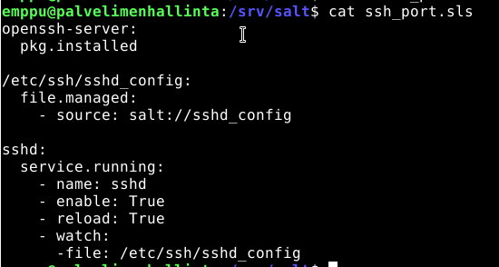

Koitin pyörittää komennon mutta se antoi virheen

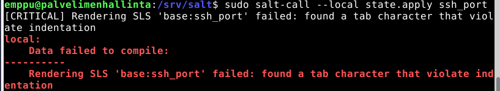

Kävin poistamassa tabit ja lisäämässä välin -file väliin ja sen jälkeen komento pyöri oikein.

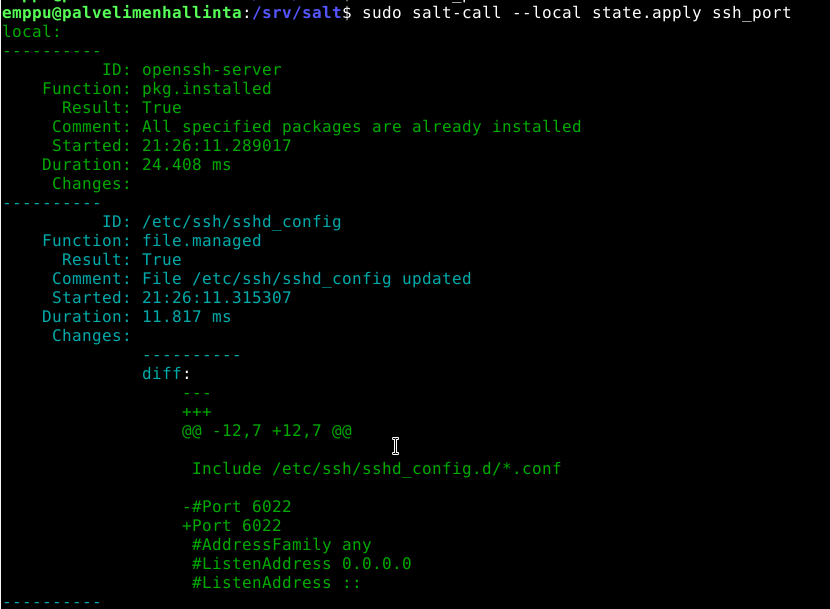

Lopuksi vielä testasin että ssh yhteyden ottaminen oikeasti toimii portista 6022.

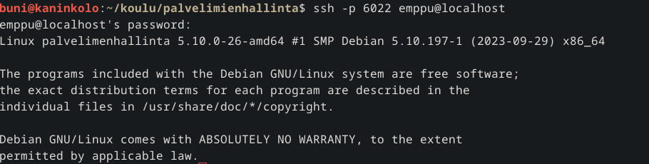

## Lähteet: 

https://docs.saltproject.io/en/latest/ref/states/top.html

https://www.linode.com/docs/guides/configure-apache-with-salt-stack/

https://salt-zh.readthedocs.io/en/latest/topics/tutorials/starting_states.html

https://terokarvinen.com/2018/pkg-file-service-control-daemons-with-salt-change-ssh-server-port/?fromSearch=salt%20ssh

https://terokarvinen.com/2023/salt-vagrant/#infra-as-code---your-wishes-as-a-text-file

https://docs.saltproject.io/salt/user-guide/en/latest/topics/overview.html#rules-of-yaml

https://docs.saltproject.io/salt/user-guide/en/latest/topics/states.html#state-modules
