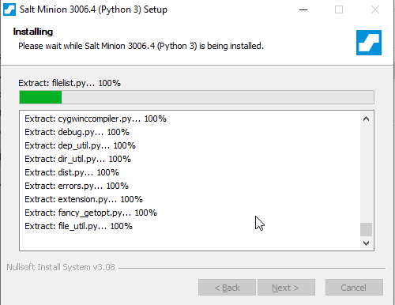
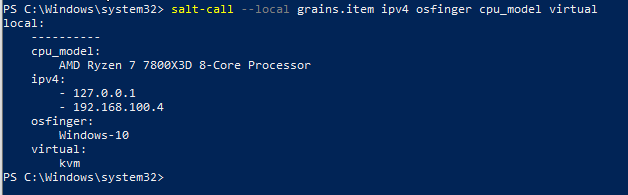
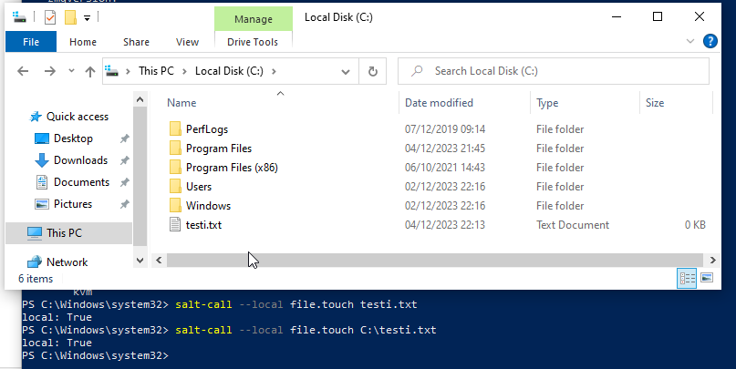
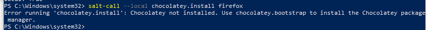
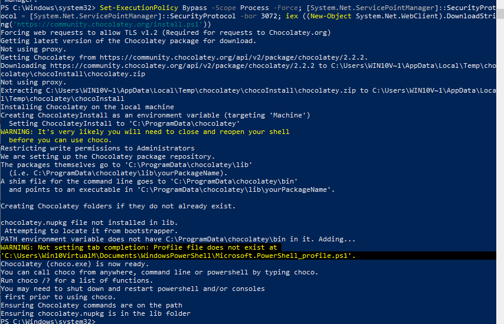
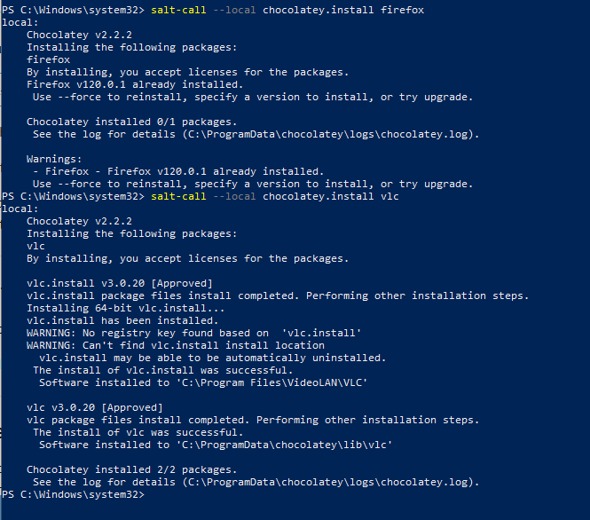
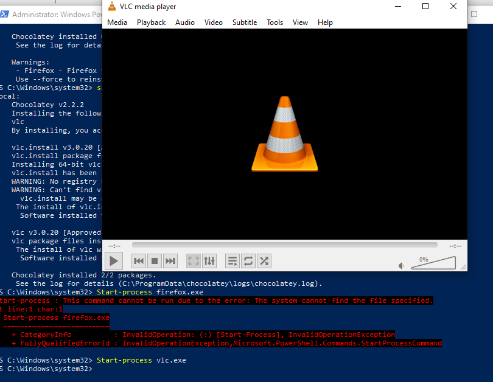
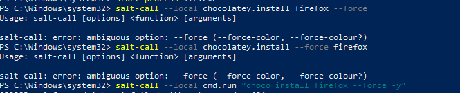
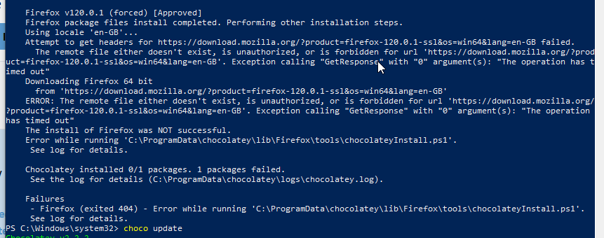

# H6 - Windows

## a ) Windowsin asentaminen virtuaalikoneelle

Asensin windowsin virtuaaliskoneelle, asennus ei mennyt läpi ilman -cpu host flagia QEMU:lla joten lisäsin sen ja latasin saltin saltproject.io sivuilta. 

## b&c) Salt-call

Asensin saltin. Testasin että salt-call toimii

Keräsin tietoja grains.items komennolla

cpu_model kertoo prosessorin mallin, -cpu host flagin takia sillä on sama prosessori nimi kun hostilla.

ipv4 kertoo localhostin sekä sisäisen verkon ipv4 osoitteen.

osfinger kertoo käyttöjärjestelmän nimen.

virtual kertoo virtualisoinnin tyypin.

## d) Salt file

Kokeilin 

	salt-call --local file.touch testi.txt

Se loi testi.txt tiedoston system32 kansioon, tei vielä uuden testin että loin testi.txt C: hakemistoon

	salt-call --local file.touch C:/testi.txt

## e)

Koitin asentaa firefoxin chocolateyn kautta saltilla mutta antoi virheen että chocolatey ei ole asennettuna, asensin individual chocolateyn.

Sen jälkeen koitin ajaa komennon uudestaan:

	salt-call --local chocolatey.install firefox

Se ei antantut mitään vastausta, mutta kuten chocalteyn asennuksen yhteyden varoituksessa luki että kannattaa käynnistää PowerShelli uudestaan niin tein sen ja koitin uudestaan ja tällä kertaa ilmoitti että pyyntö oli mennyt läpi aikaisemmin vaikka en saanut vastausta.

Joten koitin vielä asentaa VLC:n ja tällä kertaa sain vastauksen onnistuneesta asentamisesta

Testasin vielä että asennetut ohjelmat toimivat, VLC toimi ongelmitta mutta Firefox ei käynnistynyt

Luulen että asennuksessa meni jotain pieleen koska en seurannut chocolateyn ohjeita uudelleenkäynnistamisestä alkuun joten koitin pakottaa asentamaan firefoxin uudelleen --force lipulla

	salt-call --local cmd.run "choco install firefox --force -y"

Chocolatey antaa virheen ettei se löydä jotain Firefoxin asennustiedostoa.

Mozillan verkkosivut eivät myöskään toimineet, huomasin siinä samalla että QEMU oli antanut virhettä "Slirp: external icmpv6 not supported yet", en ole aiemmin törmännyt tähän virheeseen mutta päättelin että se liittyy ipv6 osoitteisiin, kävin muuttamassa regeditissä että Windows käyttäisi aina ipv4 6 sijasta mutta sekään ei auttanut, outoa on että googlen ja kaikki muut testaamani sivut toimivat normaalisti, host käyttöjärjestelmällä mozilla.org sivut toimivat normaalisti joten ongelma ei ollut myöskään Mozillan päässä.

VLC:n asennuksen demonstrointi kumminkin onnistui.

## Lähteet: 

https://terokarvinen.com/2023/configuration-management-2023-autumn/

https://terokarvinen.com/2018/04/18/control-windows-with-salt/

https://chocolatey.org/install#individual

https://superuser.com/questions/436574/ipv4-vs-ipv6-priority-in-windows-7
