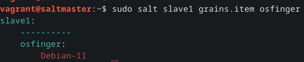
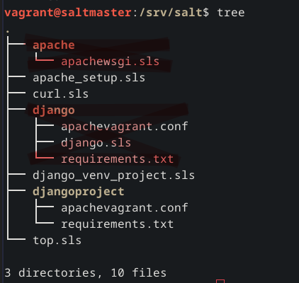
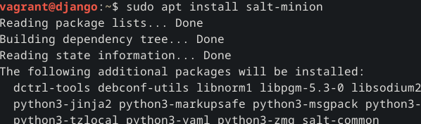
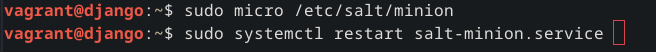
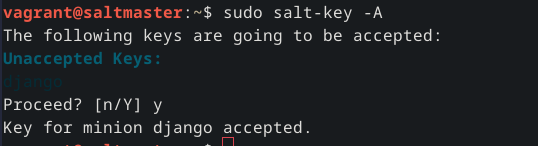
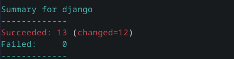
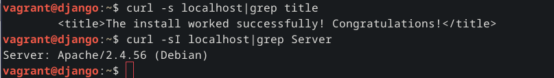

# Miniprojekti

Host kone: 

OS: Debian 12

CPU AMD 7800X3D

GPU AMD 7900XTX

RAM 32Gt.

Apachen ja Djangon asentaminen, djangon vieminen tuotanto ympäristöön Apachelle.

## Vagranttien konfigurointi käsin

Aluksi asensin vagrantin ja koneisiin tulee debian 11(vagrant init debian/bullseye64) jotta saan saltin suoraan pakettilistoilta.

Master ip: 192.168.121.39

Annoin molemmille hostname nimet jotka kuvaavat koneita, huomasin että hostname pitää antaa ennen kuin asentaa salt-minionin tai muuten koneen nimi salt-masterille on se aiempi hostname.

	hostnamectl set-hostname <VM nimi>

Minion koneella asetan Masterin ip /etc/salt/minion tiedostoon ja testasin että pystyin ajamaan komentoja.

Aluksi asensin käsin slave1 koneelle djangon käyttämään apachea 

Apache conf tiedosto [Teron Karvisen Deploy Django 4 - Production Install](https://terokarvinen.com/2022/deploy-django/) artikkelista muokattuna sopimaan minun ympäristöön, 
huomioitavaa on jos esimerkiksi Debian 12 asentaa pythonin niin pakettilistoilla on uudempi kuin 3.9 versio, 
tallennan tämän tiedoston Salt Masterille sen jälkeen kun olin testannut toimivuuden Slave1 testikoneella.

	Define TDIR /home/vagrant/publicwsgi/
	Define TWSGI /home/vagrant/publicwsgi/apachevagrant/wsgi.py
	Define TUSER vagrant
	Define TVENV /home/vagrant/publicwsgi/venv/lib/python3.9/site-packages
	
	<VirtualHost *:80>
	        Alias /static/ ${TDIR}/static/
	        <Directory ${TDIR}/static/>
	                Require all granted
	        </Directory>
	
	        WSGIDaemonProcess ${TUSER} user=${TUSER} group=${TUSER} threads=5 python-path="${TDIR}:${TVENV}"
	        WSGIScriptAlias / ${TWSGI}
	        <Directory ${TDIR}>
	             WSGIProcessGroup ${TUSER}
	             WSGIApplicationGroup %{GLOBAL}
	             WSGIScriptReloading On
	             <Files wsgi.py>
	                Require all granted
	             </Files>
	        </Directory>
	
	</VirtualHost>
	
	Undefine TDIR
	Undefine TWSGI
	Undefine TUSER
	Undefine TVENV
	
Debian 11 pakettilistoilla on python3.9 joten sitäkään ei tarvinnut muuttaa teron esimerkistä. Vagrant koneiden default käyttäjien nimi on pelkkä vagrant, luon publicwsgi kansion johon luon django projektin, djangolla annoin projektin nimeksi "apachevagrant"

## Kansio sijainnit

Kirjoitan muistiin mitä tiedostoja Djangon vieminen käyttämään Apachea tekee taikka muuttaa 

  find /etc/ -printf '%T+ %p\n' | sort

/etc/apache2/mods-available/wsgi.conf

/etc/apache2/mods-available/wsgi.load

/etc/apache2/mods-enabled/wsgi.conf (symlink, menee automaattisesti kun libapache-mod-wsgi-py3 asentuu) 

/etc/apache2/mods-enabled/wsgi.load (symlink, menee automaattisesti kun libapache-mod-wsgi-py3 asentuu)

/etc/apache2/sites-enabled/000-default.conf (default apache saitti, otetaan pois symlink)

/etc/apache2/sites-enabled/apachevagrant.conf (django apache conf tiedosto(symlink))

/etc/apache2/sites-available/000-default.conf (default apache saitti)

/etc/apache2/sites-available/apachevagrant.conf (django apache conf tästä tiedostosta tehdään symlink sites-enabled kansioon)

## Salt koodit 

Vaikka Teron ohjeissa lukee että voi käyttää suoraan nimeä koodin alussa jolloin nimeä ei tarvitse määritellä niin omasta mielestäni on helpompi lukea mitä ohjelma tekee suoraan nimestä ja määritellä paketit/tiedostot myöhemmin, 
nimi toimii siis kommenttina joita olisin muuten laittanut joka väliin. Saltin omissa ohjeissa on käytetty molempia tapoja kun taas esimerkiksi Linoden ohjeissa käytetään Teron käyttämää tapaa.

	#Apachen asennus
	apache2:
	  pkg.installed

Versus 

	Apachen_asennus:
	  -pkg.installed:
	    -name:
	      -Apache2

## Djangon asennus, django_venv_project:

asennetaan python3 ja pip
	install_python3_pip:
	  pkg.installed:
	    - names:
	      - python3
	      - python3-pip

Luodaan publicwsgi hakemisto ja annetaan kaikille käyttäjille luku ja ohjelman ajamisoikeudet, mutta vain omistajalle muokkausoikeudet joka on tässä tapauksessa vagrant

	create_publicwsgi_directory:
	  file.directory:
	    - name: /home/vagrant/publicwsgi
	    - user: vagrant
	    - group: vagrant
	    - dir_mode: 755

Asennetaan virtualenv

	install_virtualenv_pkg:
	  pkg.installed:
	    - name: virtualenv
	    
Virtuaali ympäristön luominen ja djangon asentaminen(requirements.txt:stä)

	create_virtualenv:
	  virtualenv.managed:
	    - name: /home/vagrant/publicwsgi/venv
	    - requirements: salt://djangoproject/requirements.txt
	    - user: vagrant
	    - python: python3
	    - require:
	      - pkg: install_python3_pip
	      - file: create_publicwsgi_directory

Luodaan uusi django projekti nimeltä apachevagrant. Edit: olisin tässä varmaan kopioinut tiedostot saltmasterille kun tein käsin ja sitten kopioinut tiedostot orja koneelle jos olisin ollut viisaampi aiemmin.

	create_apachevagrant_project:
	  cmd.run:
	    - name: /home/vagrant/publicwsgi/venv/bin/django-admin startproject apachevagrant .
	    - cwd: /home/vagrant/publicwsgi
	    - user: vagrant
	    - unless: test -d /home/vagrant/publicwsgi/apachevagrant

## Apachen asennus ja konfigurointi, apache_setup:

Asennetaan apache

	install_apache:
	  pkg.installed:
	    - name: apache2

Asennetaan wsgi moduuli, en laittanut apache2:n ja libapache2-mod-wsgi-py3 yhteen koska wsgi tarvitsee kansioita joita tulee apachen asennuksen yhteydessä

	install_mod_wsgi:
	  pkg.installed:
	    - name: libapache2-mod-wsgi-py3

Kopioidaan apachevagrant.conf tiedosto master koneelta /etc/apache2/sites-available/apachevagrant.conf hakemistoon

	copy_apache_config_to_minion:
	  file.managed:
	    - name: /etc/apache2/sites-available/apachevagrant.conf
	    - source: salt://djangoproject/apachevagrant.conf
	    - require:
	      - pkg: install_apache

Poistetaan Apachen default sivu (käsin sudo a2dissite 000-default.conf)

	disable_default_site:
	  file.absent:
	    - name: /etc/apache2/sites-enabled/000-default.conf

Luodaan Symlink /etc/apache2/sites-available/apachevagrant.conf sites-enabled kansioon (käsin sudo a2ensite apachevagrant.conf)

	enable_apache_site:
	  file.symlink:
	    - name: /etc/apache2/sites-enabled/apachevagrant.conf
	    - target: /etc/apache2/sites-available/apachevagrant.conf
	    - require:
	      - file: copy_apache_config_to_minion

Käynnistetään apache uudestaan jotta muutokset tulevat näkyviin.

	reload_apache:
	  service.running:
	      - name: apache2
	      - enable: True
	      - reload: True
	      - watch:
	        - file: /etc/apache2/sites-available/apachevagrant.conf
	        - file: /etc/apache2/sites-enabled/apachevagrant.conf
	        - file: /etc/apache2/sites-enabled/000-default.conf

## Asennetaan curl, :

	install_curl:
	  pkg.installed:
	    - name: curl

## Loin vielä top tilan jolla kaikki asentuu

	base:
	  '*':
	    - django_venv_project
	    - apache_setup
	    - curl

Tree kuva saltmasterin /srv/salt hakemistosta, punasella merkittyjä tiedostoja käytin kun kehitin salt tiloja joten ne eivät ole tarpeellisia.

## Testaus 

Loin uuden orja koneen(vagrant init debian/bullseye64, vagrant up, vagrant ssh), annoin sille nimeksi django(hostnamectl set-hostname django) ja käynnistin koneen uudestaan. Sen jälkeen asensin salt-minionin(sudo apt install salt-minion) ja laitoin masterin IP osoitteen /etc/salt/minion tiedostoon ja käynnistin minionin uudestaan.

Master koneella hyväksyin django koneen avaimet

Sen jälkeen pystyin pyörittämään 

	sudo salt 'django' state.apply

Jolloin top.sls tiedostossa määritellyt moduulit asentuvat django orjalle.

Ja sitten voinkin käydä katsomassa django koneella onko django asentunut ja käyttääkö se Apachea

## Lähteet: 

https://terokarvinen.com/2023/configuration-management-2023-autumn/

https://terokarvinen.com/2022/deploy-django/

https://terokarvinen.com/2018/04/03/apache-user-homepages-automatically-salt-package-file-service-example/

https://docs.saltproject.io/en/latest/ref/states/all/salt.states.virtualenv_mod.html

https://docs.saltproject.io/salt/user-guide/en/latest/topics/states.html#state-modules
